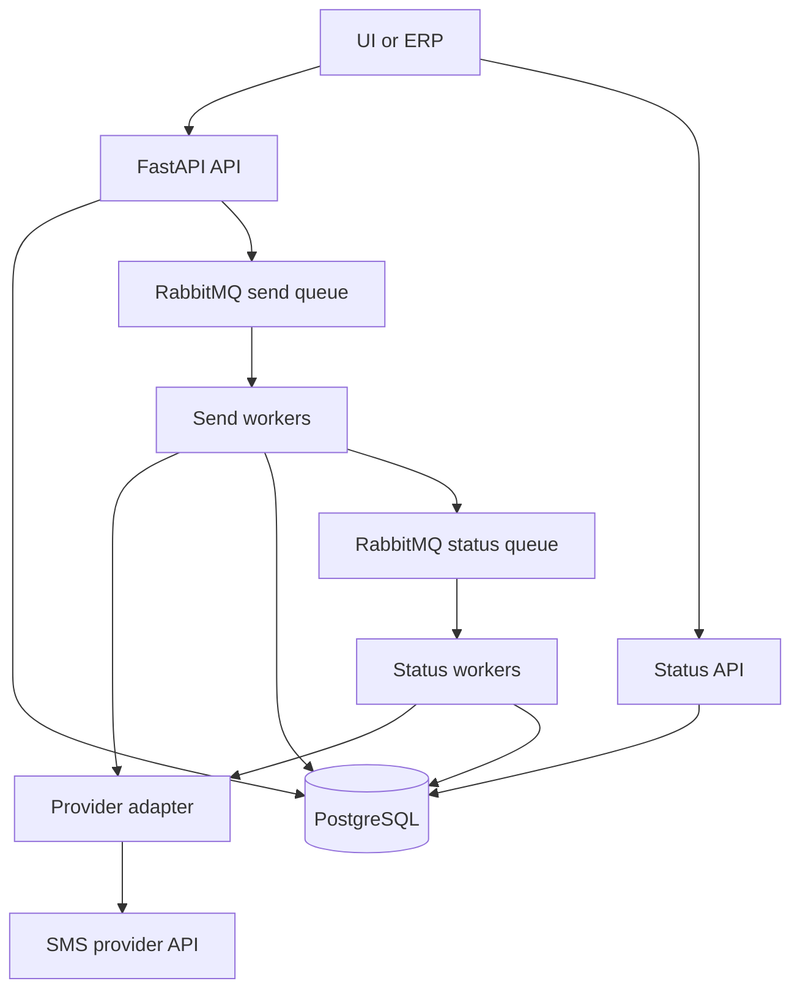

# Архитектура SMS Gateway

## Контекст

Репозиторий сейчас содержит только [README.md](README.md), поэтому план фиксирует стартовую архитектуру и требования без привязки к существующему коду.

## Цели MVP

- Дать пользователю и ERP единый API для отправки одного SMS и массовых рассылок.
- Поддержать нескольких SMS-провайдеров с разными API и лимитами батчей.
- Работать асинхронно: API быстро принимает заявку, сохраняет ее и передает отправку в фоновые воркеры через RabbitMQ.
- Хранить историю отправок, статусы, ошибки провайдера и внешние идентификаторы провайдера.
- Вернуть ERP наш идентификатор сообщения или рассылки сразу после создания заявки; статус ERP получает polling-ом через API.

## Функциональные Требования

- Отправка одиночного SMS одному получателю.
- Создание массовой рассылки на большое число получателей.
- Выбор провайдера пользователем или ERP при создании заявки.
- Валидация номера телефона, текста сообщения, выбранного провайдера, прав доступа и лимитов запроса.
- Разбиение массовой рассылки на provider batches по лимитам конкретного провайдера, например 10, 500 или другой размер.
- Абстракция провайдеров: каждый провайдер реализует единый внутренний интерфейс, но может иметь собственную схему запроса, ответа, статусов и батч-лимитов.
- Сохранение provider message id или provider batch id, полученного от провайдера.
- Запрос статуса у провайдера по его идентификатору.
- Просмотр отправленных сообщений и рассылок с фильтрами по периоду, статусу, провайдеру, источнику, получателю.
- API для ERP: создать одиночное сообщение, создать рассылку, получить статус сообщения, получить статус рассылки.
- Callback-и от провайдеров и callback-и в ERP не входят в MVP, но должны быть предусмотрены в модели и роутинге.

## Нефункциональные Требования

- Асинхронность: HTTP API не ждет фактической отправки всех SMS.
- Идемпотентность API для ERP через `Idempotency-Key` или внешний `external_id`, чтобы повторный запрос не создавал дубль рассылки.
- Надежность: задачи RabbitMQ должны быть ack-нуты только после сохранения результата обработки.
- Повторные попытки с backoff для временных ошибок провайдера.
- Dead-letter queue для задач, которые исчерпали retries.
- Наблюдаемость: structured logs, correlation id, метрики по статусам, provider latency, provider error rate, queue lag.
- Аудит: кто создал отправку, из какого источника, когда, с каким провайдером и результатом.
- Безопасность: API auth для UI и ERP, разграничение доступа по tenant/client, хранение provider credentials отдельно от бизнес-данных.
- Масштабируемость: горизонтальное масштабирование API и workers, независимое масштабирование worker-ов отправки и worker-ов обновления статусов.
- Расширяемость: добавление нового провайдера не должно менять бизнес-логику кампаний и сообщений.

## Основной Стек

- Backend: Python, лучше FastAPI для HTTP API и OpenAPI.
- DB: PostgreSQL как source of truth.
- Broker: RabbitMQ для очередей отправки, обновления статусов и retries.
- Worker runtime: свои async consumers на `aio-pika`, без Celery/Dramatiq. Это даст явный контроль над RabbitMQ topology, ack/nack, retries, DLQ и rate limiting под провайдеров.
- Migrations: Alembic.
- ORM: SQLAlchemy 2.x, желательно async engine/session через `asyncpg`; Pydantic-схемы держать отдельно от ORM-моделей.

## Доменная Модель

- `providers`: настройки провайдера, активность, batch limit, capabilities, priority, базовая стоимость, credentials reference.
- `sms_requests`: верхнеуровневая заявка от UI или ERP; одиночная отправка тоже считается request-ом.
- `sms_messages`: отдельное SMS конкретному получателю.
- `sms_batches`: внутренние батчи, нарезанные под лимиты провайдера.
- `provider_dispatches`: попытки отправки батча или сообщения провайдеру, provider ids, raw status, normalized status, error payload.
- `status_checks`: история polling-а статусов у провайдера.
- `erp_clients` или `api_clients`: клиенты внешнего API, права и лимиты.

Основные статусы:

- Request: `created`, `queued`, `processing`, `partially_sent`, `sent`, `partially_failed`, `failed`, `cancelled`.
- Message: `created`, `queued`, `submitted`, `delivered`, `undelivered`, `failed`, `unknown`.
- Batch: `created`, `queued`, `submitted`, `status_pending`, `completed`, `partially_failed`, `failed`.

## API Контуры

Пользовательский/API общий слой:

- `POST /sms/messages` - создать одиночное сообщение.
- `POST /sms/campaigns` - создать массовую рассылку.
- `GET /sms/messages/{id}` - получить статус и детали одного сообщения.
- `GET /sms/campaigns/{id}` - получить агрегированный статус рассылки.
- `GET /sms/campaigns/{id}/messages` - список сообщений внутри рассылки.
- `GET /sms/messages` - просмотр истории с фильтрами.
- `GET /providers` - список доступных провайдеров и их capabilities.

ERP API можно сделать теми же endpoint-ами с отдельной auth-схемой и `source=erp`, либо выделить `/erp/sms/...`. Я бы предпочел общий service layer и отдельный router только если ERP-контракт отличается версионированием или SLA.

## Асинхронный Flow



1. API принимает запрос, валидирует его, сохраняет `sms_request` и `sms_messages`.
2. Provider selection выбирает провайдера: в MVP явно выбранный пользователем, позже strategy engine.
3. Сервис нарезает сообщения на `sms_batches` по `provider.batch_limit`.
4. API публикует задачи отправки батчей в RabbitMQ и возвращает наш `request_id` или `message_id`.
5. Send worker вызывает adapter провайдера, сохраняет provider id и нормализованный статус.
6. Status worker периодически опрашивает провайдера по provider id и обновляет статусы сообщений/батчей.
7. UI/ERP читает статус через наш API.

## RabbitMQ Topology

С учетом выбора `aio-pika` topology лучше описать явно, а не прятать за фреймворк:

- Exchange: `sms.topic` с routing keys `sms.send`, `sms.status.check`, `sms.retry`, `sms.dead`.
- Queues: `sms.send.q`, `sms.status.q`, `sms.retry.q`, `sms.dead.q`.
- Workers используют manual ack: `ack` только после успешной фиксации результата в PostgreSQL.
- Для временных ошибок провайдера worker сохраняет попытку в `provider_dispatches`, считает следующий retry и публикует задачу в retry queue с задержкой через TTL/DLX или delayed message exchange.
- Для исчерпанных retries задача уходит в DLQ, а бизнес-статус в PostgreSQL переводится в `failed` или `partially_failed`.

## Provider Abstraction

Внутренний контракт провайдера должен быть стабильным:

```python
class SmsProviderAdapter(Protocol):
    code: str
    max_batch_size: int

    async def send_batch(self, messages: list[SmsToSend]) -> ProviderSendResult: ...
    async def get_status(self, provider_id: str) -> ProviderStatusResult: ...
```

Нюанс: у некоторых провайдеров provider id может быть на весь batch, а у некоторых на каждое сообщение. Поэтому модель должна позволять оба варианта: `provider_batch_id` на batch и `provider_message_id` на message.

## Provider Selection На Будущее

MVP:

- Используем явно выбранного провайдера.
- Если провайдер не выбран, берем дефолтного активного провайдера для tenant-а.

Позже:

- Strategy engine оценивает доступность, стоимость, страну/оператора, лимиты, error rate и SLA.
- Selection result сохраняется в request/message, чтобы решение было воспроизводимым.
- Возможен fallback на другого провайдера только до отправки сообщения. После получения provider id нельзя silently перекидывать то же сообщение без идемпотентности, иначе риск дубля SMS.

## Важные Технические Решения

- Источник истины по статусам - PostgreSQL, не RabbitMQ.
- Очереди хранят работу, но не бизнес-состояние.
- SQLAlchemy-модели описывают persisted state; Pydantic-модели описывают API-контракты и payload задач RabbitMQ.
- `aio-pika` consumers должны быть идемпотентными: повторная доставка RabbitMQ не должна приводить к повторной SMS без проверки состояния в PostgreSQL.
- Все provider responses сохранять хотя бы в нормализованном виде; raw payload можно хранить ограниченно для дебага.
- Для массовой рассылки статус кампании вычислять из статусов сообщений или поддерживать агрегаты с аккуратным обновлением.
- Для ERP обязательно нужен idempotency механизм, иначе retries с их стороны создадут дубли.
- Callback-и провайдера позже добавляются как входящий endpoint, который обновляет те же `provider_dispatches`/`sms_messages`, что и polling.

## MVP Scope

Входит:

- Один-два провайдера через adapter pattern.
- Одиночная отправка и массовая рассылка.
- Нарезка batch-ей по лимиту провайдера.
- RabbitMQ pipeline для отправки.
- Polling статусов у провайдера.
- История отправок и статусы через API.
- ERP API без callback-а.

Не входит:

- Автоматический выбор cheapest/available provider, только архитектурная точка расширения.
- Callback-и провайдера.
- Callback-и в ERP.
- Сложная тарификация и биллинг.
- SMPP, если сейчас речь только про HTTP API провайдеров.

## Риски И Открытые Решения

- Нужно уточнить SLA по скорости массовых рассылок: от этого зависит batch scheduling, rate limits и число worker-ов.
- Нужно решить, храним ли полный текст SMS вечно или вводим retention/masking.
- Нужно уточнить multi-tenant модель: один общий набор провайдеров или provider credentials на каждого клиента.
- Нужно определить контракт ERP: общий API или отдельная версия `/erp/v1`.

## Предлагаемые Следующие Артефакты

- Обновить [README.md](README.md) кратким описанием сервиса и архитектуры.
- Добавить `docs/requirements.md` с функциональными и нефункциональными требованиями.
- Добавить `docs/architecture.md` с потоками, моделями, API и очередями.
- После утверждения требований подготовить скелет FastAPI-приложения, миграции PostgreSQL и базовый RabbitMQ worker.