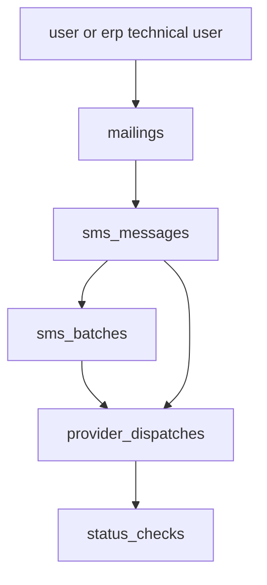
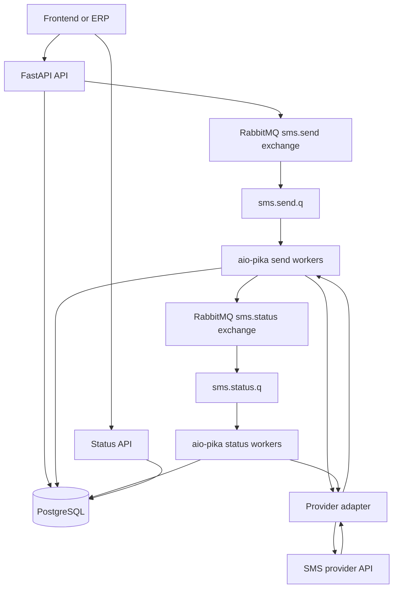

# Архитектура SMS Gateway

## Контекст

Сервис строится вокруг домена `mailing`.

`Mailing` - это рассылка, созданная пользователем или ERP. Она может содержать одно SMS одному получателю или много SMS разным получателям. Одиночная отправка не является отдельным доменом, а считается `mailing` с одним `sms_message`.

Provider `external_id` не принадлежит общей рассылке. Провайдеры возвращают идентификаторы на уровне конкретных сообщений или batch-ей, поэтому основной идентифицируемой единицей отправки является `sms_message`.

ERP использует ту же ветку API, что и frontend, но работает под отдельным техническим пользователем.

## Цели MVP

- Дать пользователю и ERP единый API для создания SMS-рассылок.
- Считать одиночную отправку частным случаем рассылки из одного `sms_message`.
- Хранить каждое SMS как отдельную сущность со своим внутренним идентификатором, статусом и provider `external_id`.
- Поддержать нескольких SMS-провайдеров с разными API, лимитами batch-ей и форматом статусов.
- Работать асинхронно: API быстро принимает рассылку, сохраняет ее и передает отправку в фоновые воркеры через RabbitMQ.
- Возвращать клиенту наш `mailing_id` сразу после создания заявки; детали и статусы сообщений клиент получает через API.
- Обеспечить polling статусов у провайдера через нашу систему без callback-ов в MVP.
- Сохранить архитектурную точку расширения под будущий автоматический выбор провайдера, например `provider_code = "auto"`.

## Функциональные Требования

- Создание рассылки с одним или несколькими SMS.
- Поддержка одиночной отправки как рассылки из одного сообщения, без отдельной доменной ветки.
- Получение списка сообщений внутри рассылки.
- Получение агрегированного статуса рассылки.
- Получение статуса и деталей конкретного сообщения.
- Ручной выбор провайдера пользователем или ERP при создании `mailing`.
- Валидация номера телефона, текста, sender, выбранного провайдера, прав доступа, лимита размера рассылки и лимитов batch-а провайдера.
- Разбиение сообщений рассылки на provider batches по лимитам конкретного провайдера, например максимум 500 сообщений на batch.
- Передача нашего внутреннего `sms_message.id` в provider payload как `custom_id`, если провайдер поддерживает такой механизм.
- Сопоставление provider response с нашими сообщениями по `custom_id` и сохранение provider `message_id` как `sms_messages.provider_message_id` или через таблицу dispatch/result.
- Абстракция провайдеров: каждый провайдер реализует единый внутренний интерфейс, но может иметь собственную схему запроса, ответа, статусов, лимитов и требований к `custom_id`.
- Просмотр истории рассылок и сообщений с фильтрами по периоду, статусу, провайдеру, источнику, получателю, sender, user.
- Единый API для frontend и ERP; ERP работает через те же endpoint-ы под выделенным техническим пользователем.
- Callback-и от провайдеров и callback-и в ERP не входят в MVP, но модель должна позволять добавить их позже.

## Нефункциональные Требования

- Асинхронность: HTTP API не ждет фактической отправки всех SMS.
- Идемпотентность создания рассылки для ERP через `Idempotency-Key` или клиентский request key, чтобы повторный запрос не создавал дубль.
- Надежность: RabbitMQ message ack выполняется только после сохранения результата обработки в PostgreSQL.
- Идемпотентность воркеров: повторная доставка задачи RabbitMQ не должна приводить к повторной отправке SMS, если сообщение уже отправлено или имеет provider id.
- Повторные попытки с backoff для временных ошибок провайдера.
- Dead-letter queue для задач, которые исчерпали retries или имеют невосстановимые ошибки payload-а.
- Наблюдаемость: structured logs, correlation id, метрики по статусам, provider latency, provider error rate, queue lag, retry count, DLQ count.
- Аудит: кто создал рассылку, из какого источника, когда, с каким провайдером, с какими параметрами и каким результатом.
- Безопасность: API auth для UI и ERP, разграничение доступа по `user`, хранение provider credentials отдельно от бизнес-данных.
- Масштабируемость: горизонтальное масштабирование API и workers, независимое масштабирование send workers и status workers.
- Расширяемость: добавление нового провайдера не должно менять бизнес-логику рассылок и сообщений.

## Основной Стек

- Backend: Python + FastAPI.
- ASGI server: Uvicorn для локального запуска; в production можно Uvicorn workers под Gunicorn или другой process manager.
- DB: PostgreSQL как source of truth.
- ORM: SQLAlchemy 2.x, желательно async engine/session через `asyncpg`.
- Migrations: Alembic.
- API schemas: Pydantic-модели отдельно от ORM-моделей.
- Broker: RabbitMQ.
- RabbitMQ client/consumers: `aio-pika`, чтобы явно контролировать topology, ack/nack, retries, prefetch, DLQ и rate limiting.
- Config: Pydantic Settings или аналогичный typed config слой.
- Observability: structured logging, correlation id, Prometheus-compatible metrics как хороший следующий шаг.

## Доменная Модель

- `users`: обычные UI-пользователи и технические пользователи ERP. ERP не получает отдельную ветку доменной модели, а работает как выделенный пользователь/роль.
- `providers`: настройки провайдера, активность, batch limit, capabilities, priority, credentials reference, rate limits.
- `mailings`: верхнеуровневая рассылка, созданная UI или ERP. Даже одиночное SMS хранится как `mailing` с одним `sms_message`.
- `sms_messages`: отдельное SMS конкретному получателю. Здесь хранится наш внутренний id, recipient/msisdn, text, sender, статус, provider selection result и provider message id.
- `sms_batches`: внутренние batch-и, нарезанные из сообщений одной рассылки под лимиты провайдера.
- `provider_dispatches`: попытки отправки batch-а или сообщения провайдеру, request payload hash, response payload, raw status, normalized status, error payload, retry metadata.
- `status_checks`: история polling-а статусов у провайдера.
- `idempotency_keys`: ключи идемпотентности для API-запросов, особенно ERP.

Ключевая связь:



Основные статусы:

- Mailing: `created`, `queued`, `processing`, `partially_submitted`, `submitted`, `partially_delivered`, `delivered`, `partially_failed`, `failed`, `cancelled`.
- Message: `created`, `queued`, `sending`, `submitted`, `delivered`, `undelivered`, `failed`, `unknown`.
- Batch: `created`, `queued`, `sending`, `submitted`, `status_pending`, `completed`, `partially_failed`, `failed`.
- Dispatch: `created`, `sent_to_provider`, `accepted`, `rejected`, `temporary_error`, `permanent_error`, `retry_scheduled`, `dead_lettered`.

Provider id placement:

- `mailings` не хранит provider `external_id`, потому что провайдер возвращает идентификаторы на уровне сообщений или batch-ей.
- `sms_messages.id` - наш стабильный идентификатор сообщения; его можно передавать провайдеру как `custom_id`, если provider API это поддерживает и лимит длины позволяет.
- `sms_messages.provider_message_id` хранит внешний id сообщения, если provider возвращает message-level id.
- `sms_batches.provider_batch_id` допустим для провайдеров, которые возвращают batch-level id.
- `provider_dispatches` хранит raw response и позволяет восстановить соответствие, если provider response сложнее одного id.

## API Контуры

Общий API для frontend и ERP:

- `POST /sms/mailings` - создать рассылку. Payload содержит обязательный `provider_code`, `sender`, массив `messages` с `msisdn`, `text` и опциональными metadata.
- `GET /sms/mailings/{mailing_id}` - получить рассылку и агрегированный статус.
- `GET /sms/mailings/{mailing_id}/messages` - получить сообщения внутри рассылки.
- `GET /sms/messages/{message_id}` - получить статус и детали одного SMS.
- `GET /sms/mailings` - история рассылок с фильтрами.
- `GET /sms/messages` - история сообщений с фильтрами.
- `GET /providers` - список доступных провайдеров и capabilities.

ERP использует те же endpoint-ы под техническим пользователем. Отличия ERP выражаются не отдельной веткой `/erp`, а auth/role/source metadata: `source=erp`, `created_by=<erp_user_id>`, возможно отдельные лимиты и idempotency policy.

На этапе MVP `provider_code` задается вручную. Значение вроде `auto` можно зарезервировать как будущий режим автоматического выбора провайдера, но в MVP оно должно возвращать validation error или явно считаться unsupported.

Пример нашего API request:

```json
{
  "provider_code": "bulk_sms_provider",
  "sender": "MyCompany",
  "messages": [
    {
      "msisdn": "375447222120",
      "text": "test message"
    }
  ]
}
```

Пример нашего response:

```json
{
  "mailing_id": "mlg_...",
  "status": "queued",
  "messages": [
    {
      "message_id": "msg_...",
      "status": "queued"
    }
  ]
}
```

## Асинхронный Flow



1. Клиент создает рассылку через `POST /sms/mailings`.
2. API валидирует payload, создает `mailings` и `sms_messages` в одной DB-транзакции.
3. Для каждого `sms_message` генерируется внутренний id. Именно этот id будет использоваться как `custom_id` у провайдеров, где это возможно.
4. Provider selection фиксирует явно выбранного провайдера из `provider_code`. В MVP автоматический выбор не выполняется.
5. Сервис группирует сообщения рассылки в `sms_batches` по `provider.max_batch_size`, provider capabilities и возможным ограничениям sender/страны.
6. API публикует задачи batch-отправки в RabbitMQ и возвращает клиенту `mailing_id` и список наших `message_id`.
7. Send worker забирает batch, проверяет состояние сообщений в PostgreSQL, чтобы не отправить уже обработанные SMS повторно.
8. Send worker вызывает provider adapter.
9. Adapter преобразует наши `sms_messages` в provider request. Для провайдера из примера это массив объектов с `msisdn`, `text`, `sender`, `custom_id`.
10. Provider возвращает result per message. Worker сопоставляет элементы ответа с нашими сообщениями по `custom_id` и сохраняет provider `message_id`, price, parts, amount, raw payload и normalized status.
11. После фиксации результата worker ack-ает RabbitMQ message.
12. Если статус требует polling-а, worker публикует задачу в status queue или планирует ее через retry/delay механизм.
13. Status worker опрашивает провайдера по provider id и обновляет `sms_messages`, `sms_batches`, агрегированный статус `mailings`.
14. UI/ERP читает состояние через наш API.

## RabbitMQ Topology

Рекомендуемая topology должна отражать типы работы, а не бизнес-сущности:

- Exchange `sms.send.x`, type `direct` или `topic`: принимает задачи на отправку batch-ей.
- Queue `sms.send.q`: основная очередь отправки.
- Queue `sms.send.retry.q`: delayed/retry очередь для временных ошибок отправки.
- Queue `sms.send.dlq`: dead-letter очередь для отправок, которые исчерпали retries.
- Exchange `sms.status.x`, type `direct` или `topic`: задачи на polling статусов.
- Queue `sms.status.q`: основная очередь status polling-а.
- Queue `sms.status.retry.q`: delayed/retry очередь для временных ошибок статусов.
- Queue `sms.status.dlq`: dead-letter очередь для статусов, которые исчерпали retries.

Routing keys:

- `sms.send.batch` - отправить batch сообщений провайдеру.
- `sms.send.retry` - повторить отправку после временной ошибки.
- `sms.status.check` - проверить статус сообщения или batch-а.
- `sms.status.retry` - повторить проверку статуса.
- `sms.dead` - финальная маршрутизация в DLQ.

Аргументация:

- Отдельные send/status exchange и queues позволяют независимо масштабировать отправку и polling.
- Отдельные retry/DLQ для send и status упрощают диагностику: ошибка отправки и ошибка polling-а имеют разный бизнес-смысл.
- Manual ack обязателен: `ack` только после записи результата в PostgreSQL.
- Prefetch должен быть ограничен, чтобы один worker не забирал слишком много batch-ей и не нарушал provider rate limits.
- Retry лучше делать через TTL + DLX или RabbitMQ delayed message exchange. Для MVP подойдет TTL + DLX, если задержки можно держать дискретными.
- DLQ не является бизнес-состоянием. При попадании в DLQ worker должен уже сохранить `failed`/`unknown`/`retry_exhausted` в PostgreSQL.
- Payload задач должен содержать идентификаторы (`batch_id`, `mailing_id`, provider code), а не полный текст всех SMS, чтобы RabbitMQ не становился хранилищем бизнес-данных.

## Provider Abstraction

Внутренний контракт провайдера должен работать с batch-ем наших сообщений и возвращать результат на уровне сообщений:

```python
class SmsProviderAdapter(Protocol):
    code: str
    max_batch_size: int

    async def send_batch(self, batch: ProviderBatch) -> ProviderSendResult: ...
    async def get_message_status(self, provider_message_id: str) -> ProviderStatusResult: ...
```

Ключевые DTO:

- `ProviderBatch`: provider code, sender, list of messages.
- `ProviderMessage`: наш `message_id`, `msisdn`, `text`, metadata.
- `ProviderSendResult`: общий успех batch-запроса, список `ProviderMessageSendResult`.
- `ProviderMessageSendResult`: наш `message_id`, provider `message_id`, normalized status, price, parts, amount, raw item.

Для провайдера из примера adapter отправляет:

```json
[
  {
    "msisdn": "375447222120",
    "text": "test message",
    "sender": "MyCompany",
    "custom_id": "msg_123"
  }
]
```

И нормализует ответ:

```json
{
  "status": true,
  "messages": [
    {
      "message_id": 0,
      "price": 0,
      "parts": 0,
      "amount": 0,
      "custom_id": "msg_123"
    }
  ]
}
```

Важно: `custom_id` у этого провайдера ограничен 20 символами. Значит наш публичный `message_id` или provider-specific correlation id должен помещаться в этот лимит. Если основной UUID длиннее, нужен короткий стабильный `provider_custom_id`, уникальный в рамках provider/dispatch-а или глобально уникальный для сообщения.

## Provider Selection На Будущее

MVP:

- Используем явно выбранного провайдера из `provider_code`.
- Если провайдер не выбран, API возвращает validation error.
- Значение `provider_code = "auto"` можно зарезервировать в контракте на будущее, но в MVP не выполнять автоматический выбор.
- Selection result сохраняется на уровне `sms_messages` и/или `sms_batches`, чтобы решение было воспроизводимым.

Позже:

- Strategy engine оценивает доступность, стоимость, страну/оператора, sender support, лимиты, error rate, SLA и текущий queue lag.
- Возможен split одной рассылки между провайдерами, но только если это явно поддержано моделью и UI/API.
- Fallback на другого провайдера допустим только до получения provider id для конкретного сообщения. После provider submit нельзя silently отправлять то же SMS через другого провайдера без жесткой идемпотентности, иначе риск дубля.
- Можно хранить provider selection policy на user-level или глобально: fixed, priority, cheapest, failover, weighted.

## Важные Технические Решения

- Главный пользовательский объект - `mailing`; одиночное SMS не имеет отдельного API-контракта создания, а создается как mailing с одним message.
- На этапе MVP домен `tenant` не вводим; ownership, права и ERP-интеграция завязаны на `user`.
- Провайдер на этапе MVP задается вручную через `provider_code`; `auto` - будущий режим, а не MVP-поведение.
- Источник истины по статусам - PostgreSQL, не RabbitMQ.
- RabbitMQ хранит работу, но не бизнес-состояние и не полный payload рассылки.
- Provider `external_id` принадлежит `sms_message` или `sms_batch`, но не общей рассылке.
- Для provider `custom_id` использовать наш message-level correlation id, а не mailing id.
- SQLAlchemy-модели описывают persisted state; Pydantic-модели описывают API-контракты и payload задач RabbitMQ.
- `aio-pika` consumers должны быть идемпотентными и использовать manual ack.
- Все provider responses сохранять минимум в нормализованном виде; raw payload можно хранить ограниченно для дебага и аудита.
- Агрегированный статус `mailing` вычисляется из статусов сообщений или поддерживается денормализованно с аккуратным обновлением в транзакциях.
- Для ERP нужен idempotency mechanism, иначе retries с их стороны создадут дубли рассылок.
- Callback-и провайдера позже добавляются как входящий endpoint, который обновляет те же `provider_dispatches` и `sms_messages`, что и polling.

## MVP Scope

Входит:

- FastAPI API для создания и просмотра рассылок.
- Единый API для frontend и ERP через разные роли/пользователей.
- User-based модель без отдельного `tenant`-домена.
- Ручной выбор провайдера при создании `mailing`.
- Один-два провайдера через adapter pattern.
- Рассылка как основной объект; одиночное SMS как частный случай.
- Хранение всех SMS в PostgreSQL со своим идентификатором.
- Передача message-level id в provider `custom_id`, если провайдер поддерживает это.
- Нарезка batch-ей по лимиту провайдера.
- RabbitMQ pipeline для отправки.
- `aio-pika` consumers для send/status задач.
- Polling статусов у провайдера.
- История рассылок, сообщений и статусы через API.
- Alembic migrations и SQLAlchemy models.

Не входит:

- Автоматический cheapest/available provider selection, включая `provider_code = "auto"` как рабочий режим.
- Callback-и провайдера.
- Callback-и в ERP.
- Сложная тарификация и биллинг.
- SMPP, если сейчас речь только про HTTP API провайдеров.
- Маркетинговые сегменты, расписания, шаблоны и A/B logic.

## TODO Работы

1. Зафиксировать базовые зависимости:
   - FastAPI
   - Uvicorn
   - SQLAlchemy 2.x
   - asyncpg
   - Alembic
   - aio-pika
   - Pydantic Settings

2. Спроектировать DB schema:
   - `users`
   - `providers`
   - `mailings`
   - `sms_messages`
   - `sms_batches`
   - `provider_dispatches`
   - `status_checks`
   - `idempotency_keys`

3. Настроить Alembic:
   - init migrations
   - async SQLAlchemy config
   - первая миграция с базовыми таблицами

4. Описать доменные enum/status:
   - `MailingStatus`
   - `SmsMessageStatus`
   - `SmsBatchStatus`
   - `ProviderDispatchStatus`

5. Реализовать FastAPI API:
   - `POST /sms/mailings`
   - `GET /sms/mailings/{mailing_id}`
   - `GET /sms/mailings/{mailing_id}/messages`
   - `GET /sms/messages/{message_id}`
   - `GET /sms/mailings`
   - `GET /sms/messages`
   - `GET /providers`

6. Реализовать создание `mailing`:
   - validate request
   - require `provider_code`
   - reject unsupported `auto`
   - create `mailing`
   - create `sms_messages`
   - create `sms_batches`
   - publish send tasks

7. Настроить RabbitMQ topology:
   - exchanges
   - send queues
   - status queues
   - retry queues
   - DLQ
   - routing keys
   - prefetch

8. Реализовать provider abstraction:
   - protocol/interface
   - DTO для batch/message/result
   - normalization layer
   - provider error mapping

9. Реализовать первый provider adapter:
   - request mapping
   - `custom_id` mapping
   - response parsing
   - provider message id persistence

10. Реализовать send worker:
    - consume `sms.send.q`
    - load batch/messages
    - idempotency checks
    - call provider adapter
    - save dispatch/results
    - update statuses
    - ack after commit
    - retry/DLQ handling

11. Реализовать status worker:
    - consume `sms.status.q`
    - call provider status API
    - normalize status
    - update `sms_messages`
    - update aggregated `mailing` status
    - retry/DLQ handling

12. Добавить идемпотентность API:
    - `Idempotency-Key`
    - request hash
    - replay existing response for duplicate request

13. Добавить базовую auth/user модель:
    - обычный user
    - ERP technical user
    - `created_by`
    - `source`

14. Добавить observability минимум:
    - structured logs
    - correlation id
    - provider request logs without secrets
    - queue/error metrics позже

15. Написать тесты:
    - create mailing
    - single SMS as mailing
    - batch splitting
    - provider response mapping by `custom_id`
    - idempotency
    - worker retry behavior